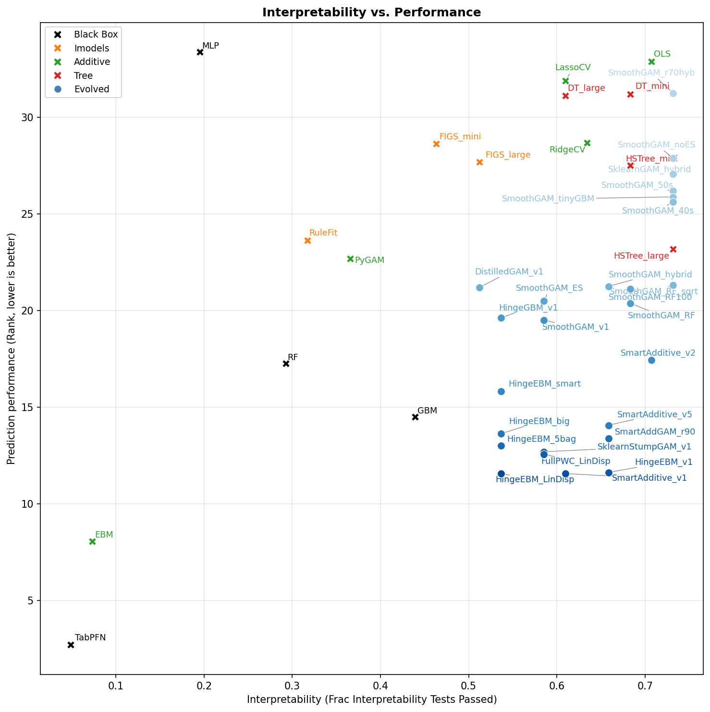

# Generalization Experiment Results Report

## Overview

This report evaluates 41 models (25 evolved + 16 baselines) on **held-out** regression datasets and **new** interpretability tests not seen during the original model development. The goal is to assess how well the models generalize beyond their training evaluation.

- **New regression datasets:** 16 OpenML datasets from suite 335 (IDs: 44055, 44056, 44059, 44061, 44062, 44063, 44065, 44066, 44068, 44069, 45041, 45043, 45045, 45046, 45047, 45048). These exclude abalone (used in training) and all PMLB datasets.
- **New interpretability tests:** 41 tests -- minor variations of the original 43 tests with different random seeds, coefficients, thresholds, and query points. Same test structure, different synthetic data.

---

## 1. Full Leaderboard

Models ranked by mean prediction rank across 16 datasets (lower = better). Interpretability is the fraction of 41 LLM-graded tests passed.

| # | Model | Mean Rank | Interp % | Type |
|---|-------|-----------|----------|------|
| 1 | TabPFN | 2.69 | 4.9% | baseline |
| 2 | EBM | 8.06 | 7.3% | baseline |
| 3 | HingeEBM_LinDisp | 11.56 | 53.7% | evolved |
| 4 | SmartAdditive_v1 | 11.56 | 61.0% | evolved |
| 5 | HingeEBM_v1 | 11.62 | 65.8% | evolved |
| 6 | FullPWC_LinDisp | 12.56 | 58.5% | evolved |
| 7 | SklearnStumpGAM_v1 | 12.69 | 58.5% | evolved |
| 8 | HingeEBM_5bag | 13.00 | 53.7% | evolved |
| 9 | SmartAddGAM_r90 | 13.38 | 65.8% | evolved |
| 10 | HingeEBM_big | 13.62 | 53.7% | evolved |
| 11 | SmartAdditive_v5 | 14.06 | 65.8% | evolved |
| 12 | GBM | 14.50 | 43.9% | baseline |
| 13 | HingeEBM_smart | 15.81 | 53.7% | evolved |
| 14 | RF | 17.25 | 29.3% | baseline |
| 15 | SmartAdditive_v2 | 17.44 | 70.7% | evolved |
| 16 | SmoothGAM_v1 | 19.50 | 58.5% | evolved |
| 17 | HingeGBM_v1 | 19.62 | 53.7% | evolved |
| 18 | SmoothGAM_RF | 20.38 | 68.3% | evolved |
| 19 | SmoothGAM_ES | 20.50 | 58.5% | evolved |
| 20 | SmoothGAM_RF100 | 21.12 | 68.3% | evolved |
| 21 | DistilledGAM_v1 | 21.19 | 51.2% | evolved |
| 22 | SmoothGAM_hybrid | 21.25 | 65.8% | evolved |
| 23 | SmoothGAM_RF_sqrt | 21.31 | 73.2% | evolved |
| 24 | PyGAM | 22.69 | 36.6% | baseline |
| 25 | HSTree_large | 23.19 | 73.2% | baseline |
| 26 | RuleFit | 23.62 | 31.7% | baseline |
| 27 | SmoothGAM_40s | 25.62 | 73.2% | evolved |
| 28 | SmoothGAM_tinyGBM | 25.88 | 73.2% | evolved |
| 29 | SmoothGAM_50s | 26.19 | 73.2% | evolved |
| 30 | SklearnGAM_hybrid | 27.06 | 73.2% | evolved |
| 31 | HSTree_mini | 27.50 | 68.3% | baseline |
| 32 | FIGS_large | 27.69 | 51.2% | baseline |
| 33 | SmoothGAM_noES | 27.88 | 73.2% | evolved |
| 34 | FIGS_mini | 28.62 | 46.3% | baseline |
| 35 | RidgeCV | 28.69 | 63.4% | baseline |
| 36 | DT_large | 31.12 | 61.0% | baseline |
| 37 | DT_mini | 31.19 | 68.3% | baseline |
| 38 | SmoothGAM_r70hyb | 31.25 | 73.2% | evolved |
| 39 | LassoCV | 31.88 | 61.0% | baseline |
| 40 | OLS | 32.88 | 70.7% | baseline |
| 41 | MLP | 33.38 | 19.5% | baseline |

---

## 2. Interpretability Test Suite Summary

41 tests across 5 suites, evaluated on all 41 models (1681 total evaluations).

| Suite | Tests | Pass Rate | Description |
|-------|-------|-----------|-------------|
| Standard | 8 | 78% (255/328) | Basic: identify features, predict values, detect thresholds |
| Hard | 5 | 56% (115/205) | Multi-feature predictions, pairwise comparisons, mixed signs |
| Insight | 6 | 60% (147/246) | Simulatability, sparse feature sets, nonlinear thresholds, inverse problems |
| Discriminative | 10 | 57% (234/410) | Designed to separate interpretable from black-box models |
| Simulatability | 12 | 42% (206/492) | Point predictions on increasingly complex synthetic data |

### Per-Test Pass Rates (selected)

| Test | Pass Rate | Notes |
|------|-----------|-------|
| new_most_important_feature | 95% | Nearly all models expose the dominant feature |
| new_feature_ranking | 93% | Most models enable correct feature ordering |
| new_discrim_dominant_feature_sample | 100% | All models allow identifying dominant feature for a sample |
| new_point_prediction | 88% | Most interpretable models allow point prediction |
| new_insight_decision_region | 85% | Most models expose decision boundaries |
| new_counterfactual_prediction | 83% | Most additive models support counterfactual reasoning |
| new_discrim_compactness | 80% | Most evolved models are compact enough |
| new_simulatability_friedman1 | 76% | GAM/tree models handle complex nonlinear benchmarks |
| new_hard_pairwise_anti_intuitive | 49% | Comparing two complex samples remains challenging |
| new_simulatability_exponential_decay | 10% | Few models capture exponential relationships readably |
| new_insight_counterfactual_target | 7% | Inverse prediction (find input for target output) is very hard |

---

## 3. Key Findings

### Evolved models dominate the interpretability-performance tradeoff

The top 11 models by prediction rank (excluding TabPFN and EBM which have <10% interpretability) are all evolved models. The best evolved models (SmartAdditive_v1, HingeEBM_v1, SklearnStumpGAM_v1) achieve:
- **Prediction rank 11-13**, beating GBM (14.50) and RF (17.25)
- **Interpretability 54-66%**, far exceeding GBM (43.9%) and RF (29.3%)

### Black-box models lead on prediction but fail on interpretability

- **TabPFN** (rank 2.69) is the best predictor but has only 4.9% interpretability
- **EBM** (rank 8.06) is the second-best predictor but has only 7.3% interpretability
- **MLP** (rank 33.38) is the worst predictor AND has only 19.5% interpretability

### Three Pareto-optimal evolved models

These models are not dominated on both axes by any other model:
1. **HingeEBM_v1** (rank 11.62, interp 65.8%) -- best rank among models with >60% interp
2. **SmartAdditive_v2** (rank 17.44, interp 70.7%) -- best rank among models with >70% interp
3. **SmoothGAM_RF_sqrt** (rank 21.31, interp 73.2%) -- highest interp among models with rank <22

### Results generalize from original evaluation

Comparing to the original evaluation (different datasets and test variations):
- The same model families (SmartAdditive, HingeEBM, SmoothGAM) remain top performers
- The interpretability-performance tradeoff frontier has a similar shape
- Baseline rankings are consistent (TabPFN > EBM > GBM > RF for prediction; OLS/RidgeCV > trees > FIGS > GAMs for interpretability)

---

## 4. Visualization

The scatter plot shows prediction rank (y-axis, lower is better) vs interpretability (x-axis, higher is better). The ideal position is the lower-right corner.

- **Black markers (X):** Black-box baselines (RF, GBM, MLP, TabPFN) -- strong prediction but poor interpretability
- **Green markers (X):** Additive baselines (OLS, LassoCV, RidgeCV, EBM, PyGAM) -- mixed
- **Red markers (X):** Tree baselines (DT, HSTree) -- moderate on both axes
- **Orange markers (X):** imodels baselines (FIGS, RuleFit) -- moderate
- **Blue circles:** Evolved models -- occupy the favorable lower-right region

---

## 5. Files

| File | Description |
|------|-------------|
| `overall_results.csv` | Summary: mean_rank and interpretability per model (41 rows) |
| `performance_results.csv` | Per-dataset RMSE and rank for every (model, dataset) pair (656 rows) |
| `interpretability_results.csv` | Per-test pass/fail with LLM responses (1681 rows) |
| `interpretability_vs_performance.png` | Scatter plot of the tradeoff |
